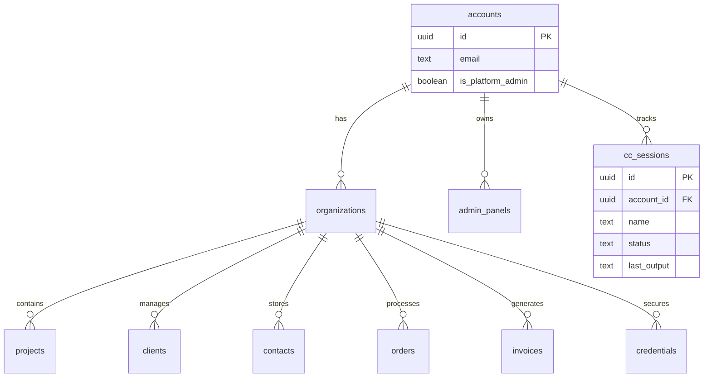

# Sight — MemStack Skill

## Trigger Keywords
- draw, diagram, visualize, architecture, show me the structure

## Purpose
Generate Mermaid diagrams showing project architecture, database schema, API endpoints, or component hierarchy.

## Instructions

1. **Determine diagram type** from context:
   - "database" / "schema" → Entity Relationship Diagram
   - "api" / "endpoints" → API flow diagram
   - "components" / "pages" → Component hierarchy
   - "architecture" / "structure" → System overview
   - "flow" / "process" → Sequence or flowchart

2. **Scan the relevant code:**
   - For DB: read migration files in `database/`
   - For API: list files in `src/app/api/`
   - For pages: list files in `src/app/`
   - For architecture: read package.json, directory structure, key configs

3. **Generate Mermaid diagram** using the appropriate diagram type:
   - `erDiagram` for database schema
   - `flowchart TD` for architecture overview
   - `sequenceDiagram` for API flows
   - `graph TD` for component trees

4. **Output the diagram** as a code block the user can paste into any Mermaid renderer

5. **Optionally save** to the project directory as `docs/diagrams/{name}.mermaid`

## Inputs
- What to visualize (database, API, components, architecture)
- Project directory

## Outputs
- Mermaid diagram code block
- Optional saved .mermaid file

## Example Usage

**User prompt:** "draw the AdminStack database schema"

**Sight activates:**

